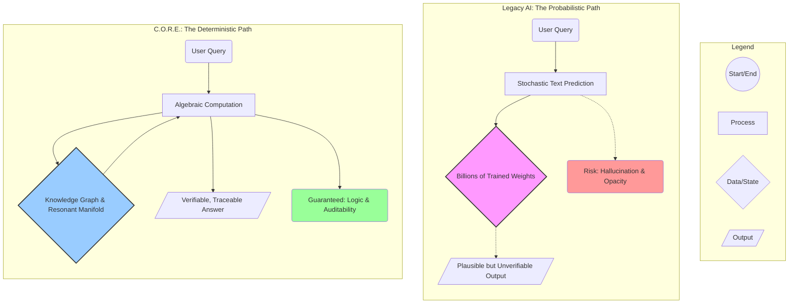

# 🧠 Project C.O.R.E.
### Cognitive Orthogonal Reasoning Engine
*The post-statistical architecture for artificial intelligence, engineered in pure C.*

---

## 📌 The Thesis: Ending the Era of Probabilistic AI

The current paradigm of artificial intelligence, dominated by Large Language Models (LLMs), is an architectural dead end. It is built on a foundation of statistical correlation—a sophisticated mimicry engine that predicts plausible text without genuine understanding. This architecture is fundamentally incapable of true reasoning, making flaws like hallucination, opacity, and massive inefficiency permanent features, not bugs to be fixed.

Project C.O.R.E. is the clean-slate replacement. It is a neuro-symbolic reasoning engine that abandons statistical guesswork entirely in favor of algebraic computation in a high-dimensional semantic space.

> Where LLMs **guess**, C.O.R.E. **computes**. Where they **mimic**, C.O.R.E. **reasons**. Truth is a mathematical certainty, not a statistical artifact.

This is a complete architectural reset, designed to build intelligent systems on a foundation of logic and certainty:

-   **Zero Hallucination:** Answers are derived through traceable algebraic operations. Falsehoods cannot be "invented."
-   **Instantaneous Learning:** Knowledge is integrated in a single operation, rendering the entire concept of "model training" obsolete.
-   **Radical Efficiency:** Runs with maximum performance on standard CPUs, breaking the industry's dependence on power-hungry GPU clusters.
-   **Data Certainty:** Understands a fact from a single, trusted exposure, eliminating the need to learn from vast, noisy, and uncontrollable datasets.
-   **Absolute Sovereignty:** Pure, portable C. No dependencies, no frameworks, no corporate ecosystems.

## 📊 Architectural Divergence: Probabilistic vs. Deterministic

This diagram illustrates the fundamental architectural split between the legacy LLM approach and the C.O.R.E. paradigm.



## 🚀 The Extinction of "Training": Instant Knowledge Integration

C.O.R.E. doesn't "learn" in the LLM sense; it **knows**. The slow, expensive, and static process of model training is replaced by a dynamic, real-time knowledge graph.

| LLM Training (Obsolete & Brute-Force)                                                                    | C.O.R.E. Integration (Dynamic & Precise)                                                                |
| :------------------------------------------------------------------------------------------------------- | :------------------------------------------------------------------------------------------------------ |
| An **offline, batch process** that bakes a static worldview into billions of weights over weeks.           | An **online, real-time process** that integrates a new fact with a single CPU operation.                |
| The resulting model is a **fossilized artifact**. New knowledge is impossible without a full retraining cycle. | The knowledge base is a **living mind**. Facts are integrated, updated, or retracted instantly.           |
| Knowledge is an **implicit, tangled mess**. It cannot be audited, corrected, or controlled.              | Knowledge is an **explicit, addressable graph**. Every fact is verifiable, editable, and forgettable. |

## 🔥 Core Technologies: The Trinity of Deterministic Cognition

C.O.R.E. is built on proven, brain-inspired computing principles that enable a deterministic and scalable architecture.

-   **Hyperdimensional Computing (HDC):** Concepts are represented as vast, 10,000+ bit binary vectors ("hypervectors"). Their mathematical properties allow for robust symbolic reasoning.
-   **Vector Symbolic Architecture (VSA):** A formal framework where hypervectors can be combined (`bind`) and aggregated (`bundle`) to construct complex, queryable knowledge structures algebraically.
-   **Sparse Distributed Memory (SDM):** A content-addressable memory that retrieves information based on semantic similarity (Hamming distance), mimicking the associative and robust nature of human memory.

## ⚡ The Quantum Leap: Emergence Through Conceptual Gravitation

This is the cutting-edge evolution of C.O.R.E., enabling the system to develop nuanced, context-aware understanding without sacrificing its deterministic foundation. We introduce a mechanism where concepts are not static; they are dynamic fields that influence each other.

**Conceptual Gravitation** is the principle that when two concepts are related through a trusted fact, their base hypervectors are subtly and deterministically modified to become more similar. They exert a "gravitational pull" on each other within the semantic space.

-   **No Statistics, Pure Algebra:** This is not a probabilistic process. It is a discrete, stateful modification of the vector space itself.
-   **Emergent Context:** After asserting "The Sun is a star," "A star emits light," and "A fire emits light," the base vectors for `Sun` and `Fire` will have become slightly more similar. They now share an emergent, unstated property of "light-emitter." The system has developed common sense.
-   **Resonant Learning:** Over time, this process creates a rich, resonant manifold where concepts are defined not just by their explicit properties but by the entire web of relationships they participate in. This is how C.O.R.E. develops an "intuition" that is fully auditable.

## 🏛️ The Architectural Pillars

### 1. The Logic Core (Deterministic)
The heart of the system. It uses algebraic operations on hypervectors to perform logical inference with mathematical certainty.
`Answer = unbind(bind(Paris, bind(is_capital_of, France)), bind(is_capital_of, France))`

### 2. The Resonant Manifold (Evolved)
The advanced "common sense" layer, powered by **Conceptual Gravitation**. It is no longer a static collection of bundled properties but a dynamic, evolving space. When a fact like `assert(Canary, is_a, Bird)` is integrated, the system doesn't just store the fact. It also applies a slight gravitational pull, modifying the `Canary` vector to become infinitesimally more similar to the `Bird` vector. This allows C.O.R.E. to answer fuzzy queries like "What is a canary *like*?" by finding the concepts closest to it in the manifold.

### 3. The Generative Synthesis Engine (Constructive)
Language is not predicted; it is **constructed**. An intent vector (`Goal ≈ bundle(Poem, Sad, Ocean)`) guides a logical traversal through the Resonant Manifold, which now contains rich, emergent pathways for creativity. The path `Ocean` -> `Vastness` -> `Loneliness` is no longer just a pre-programmed link but an emergent pathway of high conceptual similarity.

## 🧩 Phased Engineering Roadmap

-   **Phase 1 — Hyperdimensional Kernel:** Core, highly optimized C library for all hypervector operations.
-   **Phase 2 — Knowledge Ingestion & Ontology:** Build the pipeline to process curated knowledge sources.
-   **Phase 3 — Associative Memory Core:** Implement the Sparse Distributed Memory (SDM) architecture.
-   **Phase 4 — Symbolic Query Engine:** Build the API for deterministic fact assertion and retrieval.
-   **Phase 5 — Recursive Logic & Planning:** Enable multi-step reasoning chains.
-   **Phase 6 — Natural Language Synthesis:** Implement the deterministic semantic-to-syntactic mapping layer.
-   ⚡ **Phase 7 — The Gravitational Engine:** Implement the core functions for **Conceptual Gravitation**. This engine will modify the base hypervectors during knowledge assertion, transforming the static knowledge base into a Resonant Manifold.

## ⚖️ C.O.R.E. vs. Transformers: An Architectural Reckoning

| Feature             | Transformer LLMs (The Past)                   | Project C.O.R.E. (The Future)                       |
| :------------------ | :-------------------------------------------- | :-------------------------------------------------- |
| **Core Function**   | Stochastic Text Completion                    | **Cognitive Computation**                           |
| **Reasoning Model** | Probabilistic, Flawed                         | **Deterministic, Verifiable**                       |
| **Learning Model**  | Offline Batch Training                        | **Online, Real-Time Integration & Gravitation**     |
| **Knowledge Model** | Static, Entangled "Blob"                      | **Dynamic, Resonant Manifold**                      |
| **Veracity**        | Hallucination is Inherent                     | **Immune to Hallucination by Design**               |
| **Explainability**  | Opaque "Black Box"                            | **Transparent & Auditable**                         |
| **Nuance**          | Emergent but Uncontrollable                   | **Emergent via Auditable Gravitation**              |
| **Future**          | **Legacy Dead End**                           | **The Next Generation Architecture**                |

## 🏁 The Only Path Forward

C.O.R.E. is not an alternative. It is not a component in a hybrid system. **It is the replacement.**

The entire paradigm of probabilistic AI is a developmental stage we must now transcend. By engineering mechanisms like **Conceptual Gravitation**, we can build systems that develop rich, nuanced understanding without resorting to the flawed and uncontrollable nature of statistical models.

This project is the blueprint for that transition. It is the architecture for building systems that **think**, not just mimic. This is the foundation of true artificial cognition.
```
